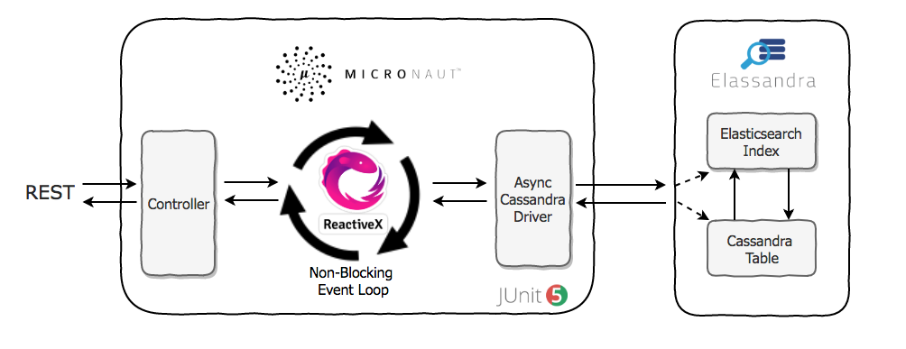
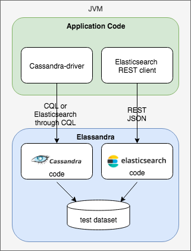
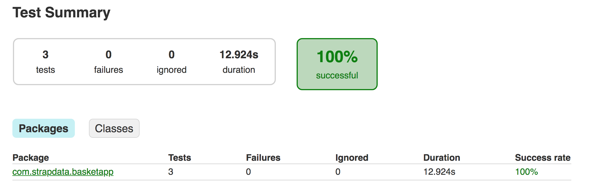
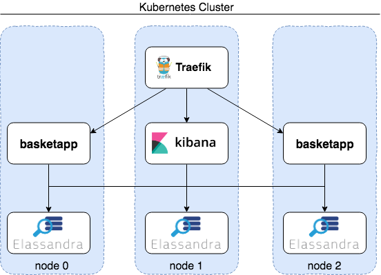

# Testing reactive microservices with Micronaut, Elassandra and JUnit5

[Micronaut](https://micronaut.io/) is a new JVM-based framework designed to make creating microservices quick and easy. One of the most exciting
features of Micronaut is its support for [reactive programming](http://reactivex.io/) and we will see in this article how to store and search
data in [Elassandra](https://www.elassandra.io/) in a reactive way through the Cassandra driver and run unit tests with Junit5.



To illustrate these features, here is a basic demo application **basketapp** (available on [github](https://github.com/strapdata/basketapp)), 
storing sales receipt in Elassandra, that is, stored in Cassandra and automatically indexed in Elasticsearch. A REST service implemented as a Micronaut 
controller expose endpoints to retrieve sales receipts by id or by store and product code. 

Here a basic JSON sales receipt with 3 products items:

```json
{
  "id": "fe2ace53-69d6-4f11-93b1-e0fde68a95cc",
  "store_code": "1",
  "basket_status": "Finished",
  "processing_date": 1551773163133,
  "items": [
    {
      "product_qty": 1,
      "amount_paid": 1,
      "product_code": "1"
    },
    {
      "product_qty": 2,
      "amount_paid": 2,
      "product_code": "2"
    },
    {
      "product_qty": 3,
      "amount_paid": 3,
      "product_code": "3"
    }
  ]
}
```

## Cassandra object mapping

In order to handle conversion between Cassandra types and custom Java object and generate CQL queries,
the java Cassandra driver provides a [Cassandra mapper](https://docs.datastax.com/en/developer/java-driver/3.5/manual/object_mapper/using/).
By combining [Jackson](https://github.com/FasterXML/jackson),
[Lombok](https://projectlombok.org/) and Cassandra mapper java annotations in 
the Basket POJO object, we get both JSON serialization and Cassandra Data Access Object.

```java
@Table(name = "baskets",
    readConsistency = "LOCAL_ONE",
    writeConsistency = "LOCAL_ONE",
    caseSensitiveKeyspace = false,
    caseSensitiveTable = false)
@Data
@Builder
@Wither
@ToString(includeFieldNames=true)
@AllArgsConstructor
@NoArgsConstructor
@JsonAutoDetect(fieldVisibility = JsonAutoDetect.Visibility.ANY)
@JsonInclude(JsonInclude.Include.NON_NULL)
public class Basket {
    @PartitionKey(0)
    UUID id;

    @Column(name = "store_code")
    @JsonProperty("store_code")
    String storeCode;

    @Column(name = "basket_status")
    @JsonProperty("basket_status")
    BasketStatus basketStatus;

    @Column(name = "processing_date")
    @JsonProperty("processing_date")
    Date processingDate;

    List<BasketItem> items;
}
```

In the same way, the **BasketItem** is mapped to a [Cassandra User Defined Type](https://docs.datastax.com/en/cql/3.3/cql/cql_using/useCreateUDT.html) as shown bellow:
 
```java
@UDT(name="basket_item")
@Data
@Builder
@Wither
@ToString(includeFieldNames=true)
@AllArgsConstructor
@NoArgsConstructor
@JsonInclude(JsonInclude.Include.NON_NULL)
public class BasketItem {

    @Field(name = "product_qty")
    @JsonProperty("product_qty")
    private Integer productQuantity;

    @Field(name = "amount_paid")
    @JsonProperty("amount_paid")
    private Double amountPaid;

    @Field(name = "product_code")
    @JsonProperty("product_code")
    private String productCode;
}
```

Finally, **BascketStatus**, a java enum, is managed through a registred codec as described in the 
[driver documentation](https://docs.datastax.com/en/developer/java-driver/3.5/manual/custom_codecs/extras/#Enums). 
Unfortunately, the java Cassandra mapper cannot generate the CQL schema, so we need to write it manually:

```bash
CREATE TYPE IF NOT EXISTS basket_item (
    product_code  text,
    product_qty   int,
    amount_paid   double
);

CREATE TABLE IF NOT EXISTS baskets (
    id              uuid PRIMARY KEY,
    store_code      text,
    basket_status   text,
    processing_date timestamp,
    total_paid      double,
    items           list<frozen<basket_item>>,

    es_query text,
    es_options text
);
```

To manage [CQL mappers](https://docs.datastax.com/en/developer/java-driver/3.5/manual/object_mapper/)  
and initialize the CQL schema and Elasticsearch indices, we use a Micronaut bean [ElassandraStorage](https://github.com/strapdata/basketapp/blob/master/src/main/java/com/strapdata/basketapp/ElassandraStorage.java).
that use the [Elasticsearch REST Client](https://www.elastic.co/guide/en/elasticsearch/client/java-rest/current/java-rest-high-create-index.html) java API.
To put it simply, we have run an [Elassandra discover](https://elassandra.readthedocs.io/en/latest/mapping.html#bi-directional-mapping) 
through the [Create Index API](https://www.elastic.co/guide/en/elasticsearch/client/java-rest/current/java-rest-high-create-index.html) 
to create the Elasticsearch index **baskets** with a mapping automatically generated from the CQL schema.


## Elasticsearch query over CQL

Elassandra closely integrates the Elasticsearch code and since version 6.2.3.11+, support for Elasticsearch query 
over the Cassandra driver is opensource, meaning that you can query Elasticsearch through the various CQL driver implementations, with
several advantages:
* Reuse the same DAO's in your application when retrieving data from Cassandra or Elasticsearch.
* No JSON overhead, query results are sent back to the application in binary.
* The CQL paging automatically manages Elasticsearch scrolling, and the last page close the scroll context.
* The CQL driver acts as a load balancer and know about load and availability of Elassandra nodes.
* When authentication is enabled, the CQL driver manage authentication at a session level while per HTTP request authentication involve an overhead.

To send the Elasticsearch search requests to an Elassandra coordinator node, we need two dummy Cassandra 
columns **es_query** and **es_options**. The Elasticsearch results comes back as Cassandra rows:

```sql
[cqlsh 5.0.1 | Cassandra 3.11.3.5 | CQL spec 3.4.4 | Native protocol v4]
Use HELP for help.
admin@cqlsh> SELECT * FROM baskets.baskets WHERE es_query='{"query":{"term":{"basket_status":"Finished"}}}';

 id                                   | basket_status | es_options | es_query | items                                                                                                                                                           | processing_date                 | store_code | total_paid
--------------------------------------+---------------+------------+----------+-----------------------------------------------------------------------------------------------------------------------------------------------------------------+---------------------------------+------------+------------
 fe2ace53-69d6-4f11-93b1-e0fde68a95cc |      Finished |       null |     null | [{product_code: '1', product_qty: 1, amount_paid: 1}, {product_code: '2', product_qty: 2, amount_paid: 2}, {product_code: '3', product_qty: 3, amount_paid: 3}] | 2019-03-05 08:06:03.133000+0000 |          1 |       null

(1 rows)
admin@cqlsh>
```

The Cassandra [Accessors](https://docs.datastax.com/en/developer/java-driver/3.5/manual/object_mapper/using/#Accessors)
annotation provides a nice way to map such custom queries. 
The CQL LIMIT clause manage the number of results returned, equivalent to the Elasticsearch query size.

```java
@Accessor
public interface BasketAccessor {

    @Query("SELECT * FROM baskets WHERE es_query = ? AND es_options='indices=baskets' LIMIT 500 ALLOW FILTERING")
    ListenableFuture<Result<Basket>> getByElasticsearchQueryAsync(String esQuery);


    public static String storeAndProductQuery(String storeCode, String productCode) {
        BoolQueryBuilder queryBuilder = new BoolQueryBuilder();

        if (storeCode != null)
            queryBuilder.filter(QueryBuilders.termQuery("store_code", storeCode));

        if (productCode != null)
            queryBuilder.filter(QueryBuilders.nestedQuery("items", QueryBuilders.termQuery("items.product_code", productCode), ScoreMode.Avg));

        if (!queryBuilder.hasClauses())
            queryBuilder.should(QueryBuilders.matchAllQuery());

        return new SearchSourceBuilder().query(queryBuilder).toString(ToXContent.EMPTY_PARAMS);
    }
}
```

A static helper method based on the 
[Elasticsearch REST High-Level](https://www.elastic.co/guide/en/elasticsearch/client/java-rest/current/java-rest-high-getting-started-initialization.html) 
API provides an easy way to build Elasticsearch queries, here a boolean query with two clauses, a term query and a nested query.

## Micronaut Reactive Data Access

Micronaut supports any framework that implements Reactive Streams, including RxJava, and Reactor.
As said in the documentation, if your controller method returns a non-blocking type then Micronaut will use the Event 
loop thread to subscribe to the result. 

In our Micronaut basket controller, [ListenableFutures](https://google.github.io/guava/releases/21.0/api/docs/com/google/common/util/concurrent/ListenableFuture.html) 
returned by the Cassandra driver are converted to reactive types such as Single or Observable. 

```java
@Controller("/basket")
@Validated
public class BasketController {

    private static final Logger logger = LoggerFactory.getLogger(BasketController.class);

    ElassandraStorage storage;
    BasketAccessor    basketAccessor;

    public BasketController(ElassandraStorage storage) {
        this.storage = storage;
        this.basketAccessor = storage.getMappingManager().createAccessor(BasketAccessor.class);
    }

    @Get("/")
    public HttpStatus index() {
        return HttpStatus.OK;
    }

    @Get(uri = "/{id}")
    public Maybe<Basket> getById(@QueryValue("id") UUID id) {
        return Maybe.fromFuture(storage.getMapper(Basket.class).getAsync(id));
    }

    @Get(uri = "/search")
    public Single<List<Basket>> getByStoreAndProduct(@Nullable @QueryValue("store_code") String storeCode, @Nullable @QueryValue("product_code") String productCode) {
        String esQuery = BasketAccessor.storeAndProductQuery(storeCode, productCode);
        return Single.fromFuture(new TransformedListenableFuture<Result<Basket>, List<Basket>>(this.basketAccessor.getByElasticsearchQueryAsync(esQuery), Result::all));
    }
}
```

The [TransformedListenableFuture](https://github.com/strapdata/basketapp/blob/master/src/main/java/com/strapdata/basketapp/utils/TransformedListenableFuture.java)
wraps the ListenableFuture<Result<X>> to convert the result by applying a mapper function, 
here [Result::all](https://docs.datastax.com/en/drivers/java/3.5/index.html?com/datastax/driver/mapping/Mapper.html). 
 
## Junit5 Elassandra Tests

The [Micronaut Testing Framework extensions](https://micronaut-projects.github.io/micronaut-test/latest/guide/index.html#introduction) 
included support for [JUnit 5](https://junit.org/junit5/), the next generation of JUnit. To test our Cassandra
and Elasticsearch queries, we wanted to use [Elassandra-Unit](https://github.com/strapdata/elassandra-unit) to run
an embedded Elassandra node during unit tests.



Nevertheless, in order to use the [Elassandra-Unit](https://github.com/strapdata/elassandra-unit) based on Junit 4, 
we need to implements some Junit 5 extensions to trigger before and after test operations. 

First, an ElassandraCQLUnit5 extension to start an embedded Elassandra node 
where we set the Cassandra system property **cassandra.custom_query_handler_class** to 
to enable support for Elasticsearch query over CQL. This could be done in the **build.gradle**, but it won't be set when
launching tests from IntelliJ IDEA, so this is more practical like that.

```Java
public class ElassandraCQLUnit5 extends CassandraCQLUnit implements BeforeEachCallback, AfterEachCallback {

    public ElassandraCQLUnit5() {
        super(new SimpleCQLDataSet("SELECT * FROM system.peers", true, false, ElassandraStorage.KEYSPACE));

        // enable the Elasticsearch CQL query handler
        System.setProperty("cassandra.custom_query_handler_class","org.elassandra.index.ElasticQueryHandler");
    }

    @Override
    public void afterEach(ExtensionContext context) throws Exception {
        super.after();
    }

    @Override
    public void beforeEach(ExtensionContext context) throws Exception {
        super.before();
    }
}
```

Then, our **BasketControllerTest** also implements a JUnit5 extension to open and cleanup Elassandra node before and 
after each tests. The **testElassandraStorage** tests our elasticsearch nested query on the baskets index.

```Java
@MicronautTest
@ExtendWith(ElassandraCQLUnit5.class)
@ExtendWith(BasketControllerTest.class)
public class BasketControllerTest implements BeforeEachCallback, AfterEachCallback {

    private static EmbeddedServer server;
    private static ElassandraStorage storage;

    @Inject
    ObjectMapper mapper;

    @BeforeAll
    public static void setupServer() {
        server = ApplicationContext.run(EmbeddedServer.class);
        storage = server.getApplicationContext().findBean(ElassandraStorage.class).get();
    }

    @AfterAll
    public static void stopServer() {
        if (server != null) {
            server.stop();
        }
    }

    @Override
    public void beforeEach(ExtensionContext context) throws Exception {
        storage.open();
    }

    @Override
    public void afterEach(ExtensionContext context) throws Exception {
        storage.cleanup();
    }

    public static final Basket DEMO_BASKET1 = new Basket()
        .withId(UUID.randomUUID())
        .withBasketStatus(BasketStatus.Finished)
        .withProcessingDate(new Date())
        .withStoreCode("1")
        .withItems(Lists.newArrayList(
            new BasketItem().withProductCode("1").withAmountPaid(1.0).withProductQuantity(1),
            new BasketItem().withProductCode("2").withAmountPaid(2.0).withProductQuantity(2),
            new BasketItem().withProductCode("3").withAmountPaid(3.0).withProductQuantity(3)
        ));

    public static final Basket DEMO_BASKET2 = new Basket()
        .withId(UUID.randomUUID())
        .withBasketStatus(BasketStatus.Finished)
        .withProcessingDate(new Date())
        .withStoreCode("1")
        .withItems(Lists.newArrayList(
            new BasketItem().withProductCode("1").withAmountPaid(1.0).withProductQuantity(1)
        ));

    
    @Test
    public void testElassandraStorage() {
        storage.getMapper(Basket.class).save(DEMO_BASKET1);
        storage.getMapper(Basket.class).save(DEMO_BASKET2);

        BasketController controller = server.getApplicationContext().getBean(BasketController.class);
        Basket basket = controller.getById(DEMO_BASKET1.getId()).blockingGet();
        assertEquals(DEMO_BASKET1, basket);

        List<Basket> basketWithProduct1 = controller.getByStoreAndProduct(null,"1").blockingGet();
        assertEquals(2, basketWithProduct1.size());
        assertTrue( basketWithProduct1.contains(DEMO_BASKET1));
        assertTrue( basketWithProduct1.contains(DEMO_BASKET2));

        List<Basket> basketWithProduct2 = controller.getByStoreAndProduct("1","2").blockingGet();
        assertEquals(1, basketWithProduct2.size());
        assertTrue( basketWithProduct2.contains(DEMO_BASKET1));
    }
    
    ...
}
```

Elassandra-Unit (like [Cassandra-Unit](https://github.com/jsevellec/cassandra-unit) developed by Jeremy Sevellec) 
use the CQL port **9142** (not the default 9042/tcp) and cluster name **"Test Cluster"** (defined in a resource file of elassandra-unit), 
the **test/resources/application.yaml** :

```yaml
cassandra:
    default:
        clusterName: "Test Cluster"
        contactPoint: localhost
        port: 9142
        maxSchemaAgreementWaitSeconds: 30
        ssl: false
```

Finally, tests are successful with our embedded Elassandra node:



## Kubernetes deployment

As a takeway, the [gradle JIB plugin](https://github.com/GoogleContainerTools/jib) quickly containerize the **basketapp**
application and publish the docker image to a docker registry:

```bash
./gradlew clean jib --image strapdata/basketapp:0.1
```

Then, you can deploy both Elassandra (Using the [Elassandra HELM Chart](https://github.com/strapdata/helm-charts)) and 
the **basketapp** on Kubernetes with a service and a deployment:

```yaml
apiVersion: v1
kind: Service
metadata:
  labels:
    app: basketapp
  name: basketapp
  namespace: default
spec:
  ports:
  - port: 8080
    protocol: TCP
    targetPort: 8080
    name: basketapp
  selector:
    app: basketapp
  sessionAffinity: None
  type: ClusterIP
---
apiVersion: apps/v1
kind: Deployment
metadata:
  name: basketapp-deployment
  labels:
    app: basketapp
spec:
  replicas: 2
  selector:
    matchLabels:
      app: basketapp
  template:
    metadata:
      labels:
        app: basketapp
    spec:
      imagePullSecrets:
      - name: acr-auth
      containers:
      - name: basketapp
        image: strapdata/basketapp:0.1
        imagePullPolicy: Always
        ports:
        - containerPort: 8080
        env:
        - name: CASSANDRA_CLUSTERNAME
          value: elassandra
        - name: CASSANDRA_CONTACTPOINT
          value: ela-cassandra
        - name: ELASTICSEARCH_HOST
          value: ela-elasticsearch
```

You can also deploy Kibana for reporting and Traefik to expose the basketapp service: 



# Conclusion

Et voilà, you get a reliable, reactive and efficient REST micro-service. Data integration tests 
are very useful in terms of making sure that our code runs correctly up to the database, and
Elassandra-Unit helps you to check both Cassandra and Elasticsearch queries.

Next step is to run automated integration tests, and Kubernetes can help to dynamically create a whole
environment and discard it afterward. You can have a look at 
the [Elassandra HELM charts](https://github.com/strapdata/helm-charts) for that.

Finally, this architecture is easy to scale by adding nodes (app or Elassandra pods), 
always up during node failures or rolling upgrades. No more database to Elasticsearch synchronization 
headache, Elassandra properly index your Cassandra data into Elasticsearch !


